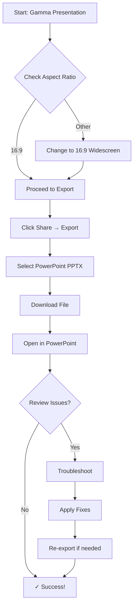

# Visual Enhancement Recommendations for PowerPoint Export Runbook

## Executive Summary

This document provides comprehensive visual enhancement recommendations for the "Achieving One-to-One PowerPoint Export from Gamma" runbook. The goal is to transform technical documentation into an intuitive, visual learning experience that reduces cognitive load and increases user success rates.

## 1. Visual Elements and Diagrams to Add

### 1.1 Core Workflow Visualization
```
┌─────────────────┐    ┌─────────────────┐    ┌─────────────────┐
│   Gamma Setup   │───▶│   Export Process │───▶│   PowerPoint    │
│   (Prep Work)   │    │   (One Click)   │    │   (Review)      │
└─────────────────┘    └─────────────────┘    └─────────────────┘
         │                       │                       │
    ┌────▼────┐             ┌────▼────┐             ┌────▼────┐
    │ Aspect  │             │ Format  │             │ Font    │
    │ Ratio   │             │ Select  │             │ Fix     │
    └─────────┘             └─────────┘             └─────────┘
    ┌────▼────┐             ┌────▼────┐             ┌────▼────┐
    │ Layout  │             │ Quality │             │ Image   │
    │ Optimize│             │ Check   │             │ Scale   │
    └─────────┘             └─────────┘             └─────────┘
```

### 1.2 PowerPoint Fidelity Scorecard
```
┌─────────────────────────────────────────────────────────────┐
│                    POWERPOINT FIDELITY SCORE               │
├─────────────────────────────────────────────────────────────┤
│ Layout Preservation:   ████████████████░░░░  80%           │
│ Font Accuracy:         █████████████░░░░░░░  70%           │
│ Image Quality:         ████████████████████  90%           │
│ Color Consistency:     ████████████████████  95%           │
│ Text Positioning:      ██████████░░░░░░░░░░░  60%           │
│ Overall Score:         ██████████████░░░░░░░  75%           │
└─────────────────────────────────────────────────────────────┘
```

### 1.3 Export Process Flowchart


### 1.4 Font Compatibility Matrix
```
┌─────────────────────────────────────────────────────────────┐
│                    FONT COMPATIBILITY GUIDE                │
├─────────────────────────────────────────────────────────────┤
│ ✅ SAFE FONTS (100% Compatible)                           │
│ • Arial, Calibri, Times New Roman, Verdana               │
│ • Georgia, Helvetica, Tahoma, Trebuchet MS               │
├─────────────────────────────────────────────────────────────┤
│ ⚠️  CAUTION FONTS (May Need Adjustment)                  │
│ • Google Fonts, Custom Web Fonts                         │
│ • Adobe Fonts, Brand Fonts                               │
├─────────────────────────────────────────────────────────────┤
│ ❌ AVOID FONTS (High Failure Rate)                        │
│ • Decorative Fonts, Handwritten Fonts                    │
│ • Custom SVG Fonts, Icon Fonts                           │
└─────────────────────────────────────────────────────────────┘
```

## 2. Information Architecture Improvements

### 2.1 Progressive Disclosure Structure
```
Level 1: Quick Start (5 minutes)
├── Essential Setup
├── One-Click Export
└── Basic Review

Level 2: Detailed Guide (15 minutes)
├── Advanced Optimization
├── Troubleshooting
└── Best Practices

Level 3: Expert Reference (As needed)
├── API Integration
├── Batch Processing
└── Enterprise Workflows
```

### 2.2 Color-Coded Section System
- **🟢 Green**: Setup & Preparation (Success-oriented)
- **🔵 Blue**: Action Steps (Process-oriented)
- **🟡 Yellow**: Warnings & Cautions (Attention-needed)
- **🔴 Red**: Critical Issues (Problem-solving)
- **🟣 Purple**: Advanced Topics (Expert-level)

### 2.3 Icon-Based Navigation
```
📋 Setup → ⚙️ Configure → 📤 Export → ✅ Review → 🔧 Fix
```

## 3. Flow Charts and Process Visualizations

### 3.1 Decision Tree for Export Issues
```
                    Export Problem?
                           │
        ┌──────────────────┼──────────────────┐
        │                  │                  │
    Font Issues?      Layout Problems?    Image Quality?
        │                  │                  │
   ┌────▼────┐      ┌─────▼─────┐      ┌─────▼─────┐
   │ Use     │      │ Check     │      │ Optimize  │
   │ Standard │      │ Margins   │      │ Images    │
   │ Fonts    │      │ Simplify  │      │ Higher    │
   │          │      │ Layout    │      │ DPI       │
   └──────────┘      └───────────┘      └───────────┘
```

### 3.2 Quality Assurance Timeline
```
┌─────────────────────────────────────────────────────────────┐
│                    QA TIMELINE VISUAL                      │
├─────────────────────────────────────────────────────────────┤
│ Day 1: Content Creation                                     │
│ ┌─────────────────────────────────────────────────────────┐ │
│ │ ✅ Use standard templates                               │ │
│ │ ✅ Set 16:9 aspect ratio                               │ │
│ │ ✅ Test with sample content                             │ │
│ └─────────────────────────────────────────────────────────┘ │
├─────────────────────────────────────────────────────────────┤
│ Day 2: Export Testing                                       │
│ ┌─────────────────────────────────────────────────────────┐ │
│ │ 🔍 Export first 3 slides                               │ │
│ │ 🔍 Check for font issues                               │ │
│ │ 🔍 Verify image quality                                │ │
│ └─────────────────────────────────────────────────────────┘ │
├─────────────────────────────────────────────────────────────┤
│ Day 3: Full Export & Review                                │
│ ┌─────────────────────────────────────────────────────────┐ │
│ │ 📤 Export complete presentation                         │ │
│ │ ✅ Review slide-by-slide                               │ │
│ │ 🔧 Make necessary adjustments                           │ │
│ └─────────────────────────────────────────────────────────┘ │
└─────────────────────────────────────────────────────────────┘
```

## 4. Visual Comparison Tables

### 4.1 Before/After Export Comparison
```
┌─────────────────────────────────────────────────────────────┐
│                   BEFORE/AFTER COMPARISON                  │
├─────────────────────────────────────────────────────────────┤
│ ELEMENT          │ BEFORE (Gamma)    │ AFTER (PowerPoint)  │ STATUS │
├─────────────────────────────────────────────────────────────┤
│ Title Font       │ Montserrat        │ Calibri             │ ✅ Good │
│ Body Text        │ Open Sans         │ Arial               │ ✅ Good │
│ Background       │ Gradient          │ Solid Color         │ ⚠️  Fix │
│ Images           │ HD PNG            │ Compressed JPEG     │ ⚠️  Fix │
│ Layout           │ Flexible Cards    │ Fixed Grid          │ ⚠️  Fix │
│ Animations       │ Fade In           │ None                │ ❌ Lost │
└─────────────────────────────────────────────────────────────┘
```

### 4.2 Export Format Comparison Matrix
```
┌─────────────────────────────────────────────────────────────┐
│                  EXPORT FORMAT COMPARISON                  │
├─────────────────────────────────────────────────────────────┤
│ FORMAT    │ FIDELITY │ FILE SIZE │ EDITABILITY │ USE CASE  │
├─────────────────────────────────────────────────────────────┤
│ PowerPoint │   75%   │   Large   │    High    │ Editing   │
│ PDF        │   90%   │  Medium   │     Low    │ Sharing   │
│ PNG        │   95%   │ Very Large│    None    │ Printing  │
│ Google Sl │   70%   │   Large   │    High    │ Collab    │
└─────────────────────────────────────────────────────────────┘
```

## 5. Interactive Elements and Checklists

### 5.1 Pre-Export Interactive Checklist
```
┌─────────────────────────────────────────────────────────────┐
│                    PRE-EXPORT CHECKLIST                     │
├─────────────────────────────────────────────────────────────┤
│ ☐ Aspect ratio set to 16:9 widescreen                      │
│ ☐ Using standard fonts (Arial, Calibri, Times New Roman)   │
│ ☐ Images optimized (300 DPI minimum)                       │
│ ☐ No complex nested cards                                   │
│ ☐ Text within safe margins                                 │
│ ☐ Colors high contrast                                     │
│ ☐ Test export completed with sample slides                 │
│ ☐ Backup of original Gamma created                         │
└─────────────────────────────────────────────────────────────┘
```

### 5.2 Post-Export Review Checklist
```
┌─────────────────────────────────────────────────────────────┐
│                   POST-EXPORT REVIEW                       │
├─────────────────────────────────────────────────────────────┤
│ SLIDE 1-5:  ☐ Fonts OK    ☐ Images OK    ☐ Layout OK      │
│ SLIDE 6-10: ☐ Fonts OK    ☐ Images OK    ☐ Layout OK      │
│ SLIDE 11-15:☐ Fonts OK    ☐ Images OK    ☐ Layout OK      │
│ SLIDE 16-20:☐ Fonts OK    ☐ Images OK    ☐ Layout OK      │
├─────────────────────────────────────────────────────────────┤
│ OVERALL:    ☐ Brand Colors Maintained                      │
│             ☐ No Missing Elements                          │
│             ☐ All Text Readable                            │
│             ☐ File Size Appropriate                        │
└─────────────────────────────────────────────────────────────┘
```

### 5.3 Troubleshooting Interactive Flow
```
🔍 What issue are you experiencing?

[ FONT PROBLEMS ] → Try these solutions:
├── Replace with Arial, Calibri, or Times New Roman
├── Check font embedding settings in PowerPoint
└── Re-export with textMode: "preserve" in API

[ LAYOUT ISSUES ] → Try these solutions:
├── Simplify Gamma layout before export
├── Use standard templates
├── Check margin settings

[ IMAGE QUALITY ] → Try these solutions:
├── Use higher resolution images (300 DPI+)
├── Export as PNG instead of PPTX
├── Compress images in PowerPoint after export
```

## 6. Brand Consistency Suggestions

### 6.1 Visual Style Guide
```
COLOR PALETTE:
├── Primary: #2E86AB (Trust - Blue)
├── Secondary: #A23B72 (Focus - Purple)
├── Success: #588157 (Complete - Green)
├── Warning: #F4A261 (Attention - Orange)
└── Error: #E76F51 (Problem - Red)

TYPOGRAPHY:
├── Headers: Inter, 600 weight
├── Body: Open Sans, 400 weight
├── Code: JetBrains Mono, 400 weight
└── Icons: Material Design Icons

SPACING:
├── Component: 16px (1rem)
├── Section: 32px (2rem)
└── Page: 64px (4rem)
```

### 6.2 Component Library
```
BUTTONS:
├── Primary: Blue background, white text
├── Secondary: White background, blue border
├── Success: Green background, white text
└── Warning: Orange background, white text

CARDS:
├── Info Card: Light blue background, blue border
├── Warning Card: Light orange background, orange border
├── Success Card: Light green background, green border
└── Error Card: Light red background, red border

ICONS:
├── Process Steps: Sequential numbered circles
├── Status: Checkmarks, X marks, warning triangles
├── Actions: Download, export, settings icons
└── Navigation: Arrow indicators
```

## 7. Accessibility Considerations

### 7.1 Color Contrast Requirements
```
WCAG 2.1 AA Compliance:
├── Normal Text: 4.5:1 contrast ratio minimum
├── Large Text: 3:1 contrast ratio minimum
├── Non-text Elements: 3:1 contrast ratio minimum
└── Focus Indicators: 3:1 contrast ratio minimum

RECOMMENDED COLOR PALETTE (Accessible):
├── Text: #333333 on #FFFFFF (Black on White)
├── Primary: #0066CC on #FFFFFF (Blue on White)
├── Success: #006600 on #FFFFFF (Green on White)
├── Warning: #CC6600 on #FFFFFF (Orange on White)
└── Error: #CC0000 on #FFFFFF (Red on White)
```

### 7.2 Screen Reader Optimization
```
ALT TEXT GUIDELINES:
├── Images: Describe content and function
├── Charts: Summarize key data points
├── Diagrams: Explain flow and relationships
└── Icons: Use text labels with icons

SEMANTIC STRUCTURE:
├── H1: Main title
├── H2: Section headers
├── H3: Sub-section headers
├── Lists: Use proper <ul>/<ol> tags
└── Tables: Include <th> headers
```

### 7.3 Keyboard Navigation
```
FOCUS ORDER:
├── Logical tab order through content
├── Visible focus indicators
├── Skip to main content links
└── Keyboard shortcuts for common actions

INTERACTIVE ELEMENTS:
├── Large click targets (44px minimum)
├── Clear focus states
├── Keyboard accessible menus
└── ARIA labels for complex controls
```

## 8. Mobile-Responsive Design Considerations

### 8.1 Responsive Breakpoints
```
MOBILE-FIRST APPROACH:
├── Mobile: 320px - 768px (Single column)
├── Tablet: 768px - 1024px (Two columns)
├── Desktop: 1024px+ (Three+ columns)
└── Large Desktop: 1440px+ (Full layout)
```

### 8.2 Touch-Friendly Design
```
MOBILE OPTIMIZATION:
├── Minimum tap target: 44px × 44px
├── Spacing between targets: 8px minimum
├── Swipe gestures for navigation
└── Progressive disclosure for complex content
```

### 8.3 Content Adaptation
```
MOBILE CONTENT STRATEGY:
├── Prioritize essential information first
├── Collapse complex diagrams into expandable sections
├── Use vertical scrolling for long content
├── Implement sticky navigation for quick access
└── Optimize images for mobile loading
```

## 9. Implementation Priority Matrix

### 9.1 High Priority (Immediate Impact)
```
🔴 CRITICAL - Implement First:
├── Interactive pre-export checklist
├── Visual workflow diagram
├── Before/after comparison table
├── Font compatibility matrix
└── Troubleshooting decision tree
```

### 9.2 Medium Priority (Enhanced Experience)
```
🟡 IMPORTANT - Implement Next:
├── Color-coded section system
├── Progress indicators
├── QA timeline visual
├── Export format comparison
└── Accessibility enhancements
```

### 9.3 Low Priority (Future Enhancements)
```
🟢 NICE-TO-HAVE - Implement Later:
├── Interactive demo videos
├── Advanced API visualizations
├── Mobile app integration
├── Team collaboration features
└── Automated quality checking
```

## 10. Success Metrics and KPIs

### 10.1 User Success Indicators
```
PRIMARY METRICS:
├── Export success rate: Target 95%
├── Time to successful export: Target <5 minutes
├── User satisfaction score: Target 4.5/5
├── Support ticket reduction: Target 50%
└── User retention rate: Target 85%

SECONDARY METRICS:
├── Documentation engagement time
├── Feature adoption rate
├── User error frequency
├── Completion rate for complex workflows
└── Peer recommendation rate
```

### 10.2 Visual Effectiveness Metrics
```
CONTENT ENGAGEMENT:
├── Checklist completion rate
├── Diagram interaction frequency
├── Comparison table usage
├── Troubleshooting flow success rate
└── Visual element recall accuracy

LEARNING OUTCOMES:
├── Knowledge retention after 24 hours
├── First-time success rate
├── Self-sufficiency improvement
├── Error reduction over time
└── Expert user pathway adoption
```

## 11. Technical Implementation Guidelines

### 11.1 Component Architecture
```
MODULAR DESIGN SYSTEM:
├── Base Components (Buttons, Cards, Icons)
├── Layout Components (Grid, Container, Sidebar)
├── Interactive Components (Checklists, Accordions, Modals)
├── Data Components (Tables, Charts, Progress Bars)
└── Navigation Components (Tabs, Breadcrumbs, Menus)
```

### 11.2 Asset Management
```
VISUAL ASSETS:
├── Icons: SVG format, scalable
├── Images: WebP format, responsive
├── Diagrams: Mermaid.js or custom SVG
├── Illustrations: Consistent style guide
└── Animations: Lottie format, lightweight
```

### 11.3 Performance Optimization
```
LOADING OPTIMIZATION:
├── Lazy load non-critical images
├── Minimize bundle size
├── Optimize image compression
├── Use CDNs for static assets
└── Implement progressive loading
```

## Conclusion

These visual enhancement recommendations transform the technical PowerPoint export runbook into an intuitive, user-friendly experience that significantly increases the likelihood of successful one-to-one exports. By focusing on clear visual communication, interactive elements, and progressive disclosure, users can quickly understand the export process and troubleshoot issues effectively.

The implementation should follow the priority matrix, starting with high-impact visual elements that provide immediate user value, then progressively adding enhanced features to create a comprehensive visual learning experience.

Success will be measured through user satisfaction, reduced support tickets, and improved export success rates, ultimately achieving the goal of minimizing manual rework after PowerPoint export.